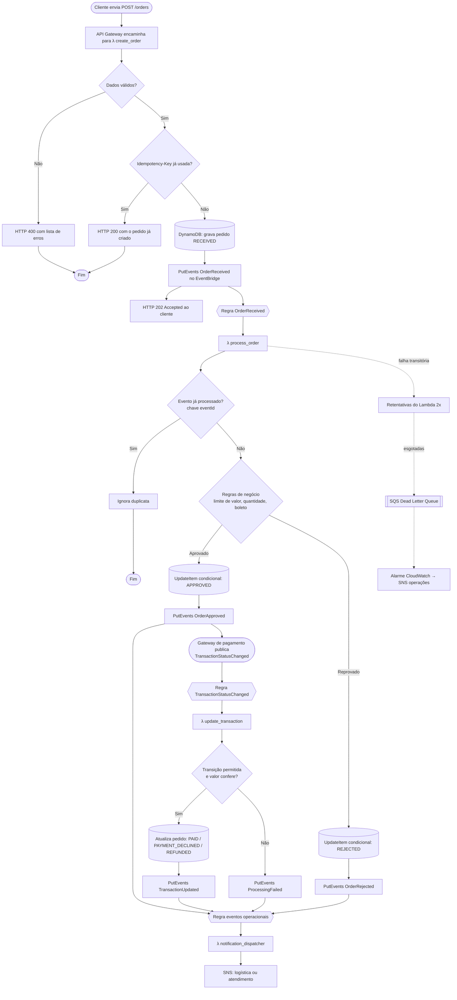
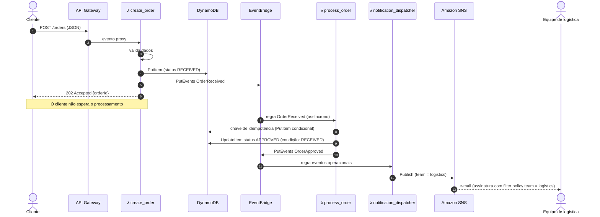
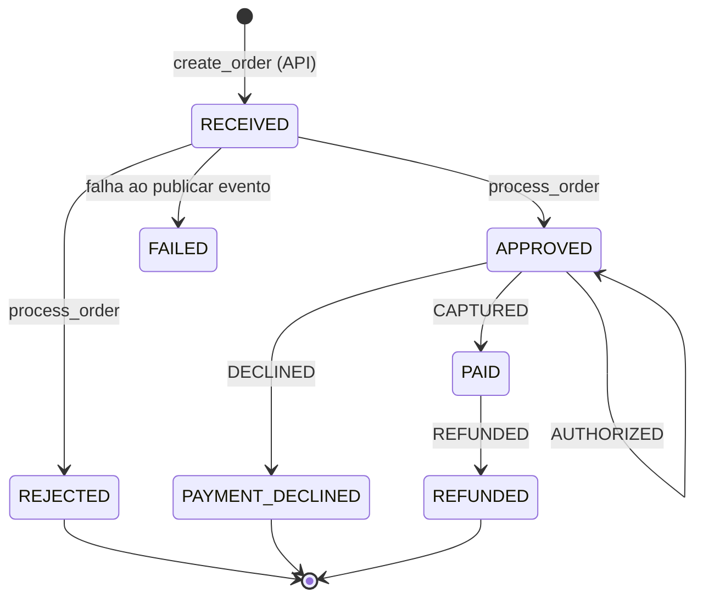

# Fluxo de recebimento e processamento de pedidos (Fluxos 1, 2 e 4)

## Fluxograma

```mermaid
flowchart TD
    A([Cliente envia POST /orders]) --> B[API Gateway encaminha para λ create_order]
    B --> C{Dados válidos?}
    C -- Não --> C1[HTTP 400 com lista de erros] --> Z1([Fim])
    C -- Sim --> D{Idempotency-Key já usada?}
    D -- Sim --> D1[HTTP 200 com o pedido já criado] --> Z1
    D -- Não --> E[(DynamoDB: grava pedido RECEIVED)]
    E --> F[PutEvents OrderReceived no EventBridge]
    F --> G[HTTP 202 Accepted ao cliente]
    F --> H{{Regra OrderReceived}}
    H --> I[λ process_order]
    I --> J{Evento já processado?<br/>chave eventId}
    J -- Sim --> J1[Ignora duplicata] --> Z2([Fim])
    J -- Não --> K{Regras de negócio<br/>limite de valor, quantidade, boleto}
    K -- Aprovado --> L[(UpdateItem condicional: APPROVED)]
    K -- Reprovado --> M[(UpdateItem condicional: REJECTED)]
    L --> N[PutEvents OrderApproved]
    M --> O[PutEvents OrderRejected]
    N & O --> P{{Regra eventos operacionais}}
    P --> Q[λ notification_dispatcher]
    Q --> R[SNS: logística ou atendimento]
    I -. falha transitória .-> S[Retentativas do Lambda 2x]
    S -. esgotadas .-> T[[SQS Dead Letter Queue]]
    T -.-> U[Alarme CloudWatch → SNS operações]

    N --> V([Gateway de pagamento publica<br/>TransactionStatusChanged])
    V --> W{{Regra TransactionStatusChanged}}
    W --> X[λ update_transaction]
    X --> Y{Transição permitida<br/>e valor confere?}
    Y -- Sim --> Y1[(Atualiza pedido: PAID / PAYMENT_DECLINED / REFUNDED)] --> Y2[PutEvents TransactionUpdated] --> P
    Y -- Não --> Y3[PutEvents ProcessingFailed] --> P
```

## Sequência temporal

```mermaid
sequenceDiagram
    autonumber
    actor C as Cliente
    participant API as API Gateway
    participant CO as λ create_order
    participant DB as DynamoDB
    participant EB as EventBridge
    participant PO as λ process_order
    participant ND as λ notification_dispatcher
    participant SNS as Amazon SNS
    actor LOG as Equipe de logística

    C->>API: POST /orders (JSON)
    API->>CO: evento proxy
    CO->>CO: valida dados
    CO->>DB: PutItem (status RECEIVED)
    CO->>EB: PutEvents OrderReceived
    CO-->>C: 202 Accepted {orderId}
    Note over C,CO: O cliente não espera o processamento
    EB->>PO: regra OrderReceived (assíncrono)
    PO->>DB: chave de idempotência (PutItem condicional)
    PO->>DB: UpdateItem status APPROVED (condição: RECEIVED)
    PO->>EB: PutEvents OrderApproved
    EB->>ND: regra eventos operacionais
    ND->>SNS: Publish (team = logistics)
    SNS-->>LOG: e-mail (assinatura com filter policy team = logistics)
```

## Estados do pedido

```mermaid
stateDiagram-v2
    [*] --> RECEIVED: create_order (API)
    RECEIVED --> APPROVED: process_order
    RECEIVED --> REJECTED: process_order
    RECEIVED --> FAILED: falha ao publicar evento
    APPROVED --> APPROVED: AUTHORIZED
    APPROVED --> PAID: CAPTURED
    APPROVED --> PAYMENT_DECLINED: DECLINED
    PAID --> REFUNDED: REFUNDED
    REJECTED --> [*]
    PAYMENT_DECLINED --> [*]
    REFUNDED --> [*]
```
